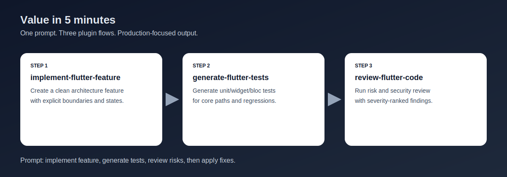

# flutter-cursor-plugin

Open-source Cursor plugin for production Flutter development and testing.

## Quickstart (1-5 minutes)

1. Install/enable the plugin in Cursor.
2. Ensure Dart MCP is available (`dart mcp-server`) and keep `mcp.json` in this repo enabled.
3. Run one practical flow:
   - `implement-flutter-feature` for feature scaffolding and implementation.
   - `generate-flutter-tests` for unit/widget/bloc/Patrol E2E tests.
   - `review-flutter-code` for risk-focused review with mandatory security checks.
4. Use `prepare-mobile-release` and `setup-mobile-github-pipeline` before shipping Android/iOS builds.

## Value in 5 minutes



Use one copy-paste prompt to verify end-to-end value fast:

```text
Implement a profile editing feature in Flutter with clean architecture.
Then generate widget and bloc tests for the new feature.
Finally run a risk-focused review with security checks and list fixes by severity.
```

Expected outcome:
- Feature scaffold + implementation plan from `implement-flutter-feature`.
- Test generation flow from `generate-flutter-tests`.
- Risk and security findings from `review-flutter-code` + `security-review`.

Three ready-to-run scenarios:
1. Feature + tests + review:
   - `implement-flutter-feature` -> `generate-flutter-tests` -> `review-flutter-code`
2. Dependency upgrade safety pass:
   - `update-flutter-dependencies` -> `docs/dependency-upgrade-checklist.md`
3. Release readiness:
   - `prepare-mobile-release` -> `setup-mobile-github-pipeline`

## Manifest and compatibility

- Canonical manifest: `.cursor-plugin/plugin.json` (schema-aligned for Cursor plugins).
- Compatibility manifest kept for existing setups: `plugin.json`.
- MCP auto-configuration: `mcp.json` (Dart MCP server).

## Compatibility matrix

- Cursor plugins: latest stable with plugin support.
- Flutter SDK: stable channel recommended.
- Dart SDK: must support `dart mcp-server`.
- Patrol: required only for Patrol E2E scenarios.
- Monorepo/workspace usage: see `docs/monorepo-workspace-guide.md`.

## What this plugin covers

- Flutter feature implementation with clean architecture defaults.
- Figma-to-Flutter implementation workflow with Figma MCP.
- Dart/Flutter analysis and code generation workflows with Dart MCP.
- Full testing strategy: unit, widget, bloc/cubit, and Patrol E2E.

## Core principles

- Keep business logic outside widgets.
- Prefer deterministic async and explicit state transitions.
- Keep selectors stable and tests behavior-first.
- Favor small, composable widgets and injected dependencies.

## Included assets

- **Release checklist**: `docs/official-release-checklist.md` for official/public release prep.
- **Security posture**: `docs/security-posture.md` for `/security-review` scope, false-positive handling, and CI integration.
- **Agents**
  - `flutter-app-builder` (general Flutter implementation)
  - `flutter-code-reviewer`
  - `flutter-mobile-release-manager`
  - `flutter-test-writer`
- **Commands**
  - `implement-flutter-feature`
  - `implement-figma-screen`
  - `scaffold-flutter-feature`
  - `generate-flutter-tests`
  - `migrate-flutter-code`
  - `resolve-flutter-build-error`
  - `review-flutter-code`
  - `update-flutter-dependencies`
  - `prepare-mobile-release`
  - `setup-mobile-github-pipeline`
  - `integrate-firebase`
  - `security-review`
  - `sync-official-flutter-ai-rules`
  - `write-widget-test`
  - `write-bloc-test`
  - `write-e2e-test`
- **Rules**
  - `rules/flutter-development-best-practices.mdc`
  - `rules/dart-effective-dart.mdc`
  - `rules/flutter-test-best-practices.mdc`
- **Skills**
  - `skills/build-flutter-features/`
  - `skills/scaffold-flutter-architecture/`
  - `skills/release-mobile-apps/`
  - `skills/integrate-firebase/`
  - `skills/write-flutter-tests/`
  - `skills/review-flutter-code/`
  - `skills/debug-flutter-issues/`
  - `skills/migrate-flutter-code/`
  - `skills/update-flutter-dependencies/`
  - `skills/security-audit/`
  - `skills/sync-official-flutter-ai-rules/`

## MCP integrations

- **Dart MCP**: use for analysis, fix suggestions, formatting guidance, and project-aware Dart/Flutter workflows.
- **Figma MCP**: use when translating Figma nodes/screens to Flutter UI with higher visual fidelity.
- **Effective Dart**: align implementation with the official guidance at https://dart.dev/effective-dart.
- **Claude `/security-review` parity**: security workflow mirrors `anthropics/claude-code-security-review` patterns (diff-aware + false-positive filtering).
- **Official Flutter AI rules sync**: use `sync-official-flutter-ai-rules` to refresh upstream Flutter rules profiles.

## Official documentation

- Flutter Android deployment: https://docs.flutter.dev/deployment/android
- Flutter iOS deployment: https://docs.flutter.dev/deployment/ios
- Firebase setup for Flutter: https://firebase.google.com/docs/flutter/setup
- Android App Bundle guide: https://developer.android.com/guide/app-bundle
- App Store Connect submission: https://developer.apple.com/help/app-store-connect/manage-submissions-to-app-review/submit-an-app
- Claude Code Security Review: https://github.com/anthropics/claude-code-security-review
- Cursor plugin schema: https://raw.githubusercontent.com/cursor/plugins/main/schemas/plugin.schema.json
- Flutter MCP server docs: https://docs.flutter.dev/ai/mcp-server
- Flutter Cursor + AI rules docs: https://docs.flutter.dev/ai/cursor

## Requirements

- Flutter SDK and Dart tooling.
- Patrol (only if you run Patrol E2E tests).
- Dart MCP server configured in Cursor.
- Figma MCP server configured in Cursor for design implementation tasks.

## Usage

1. Enable this plugin in Cursor.
2. For feature work, use `flutter-app-builder` or `implement-flutter-feature`.
3. For design implementation, use `implement-figma-screen` (Figma MCP).
4. For testing, use `flutter-test-writer` or `generate-flutter-tests`.
5. For migrations, debugging, and reviews use dedicated commands:
   - `migrate-flutter-code`
   - `resolve-flutter-build-error`
   - `review-flutter-code`
   - `update-flutter-dependencies`
   - or use dedicated review agent: `flutter-code-reviewer`
6. For Android/iOS publication readiness use:
   - `flutter-mobile-release-manager`
   - `prepare-mobile-release`
   - `docs/mobile-app-publishing-checklist.md`
   - `setup-mobile-github-pipeline`
   - `docs/mobile-ci-pipeline-checklist.md`
7. For Firebase integration use:
   - `integrate-firebase`
   - `docs/firebase-integration-checklist.md`
8. For security audit and secrets scanning use:
   - `security-review`
   - `docs/security-audit-checklist.md`
   - `docs/security-posture.md`
9. Keep generated output aligned with plugin rules.
10. For dependency upgrades, also follow:
   - `docs/dependency-upgrade-checklist.md`
11. For monorepo/workspace setups, follow:
   - `docs/monorepo-workspace-guide.md`
12. To sync official Flutter AI rules profiles (`10k`/`4k`/`1k`), use:
   - `sync-official-flutter-ai-rules`
   - `docs/flutter-ai-rules-sync.md`

Note: every code review flow includes mandatory security checks (OWASP MASVS-oriented).

## Top use cases

1. Architecture scaffolding for new feature modules (BLoC/Riverpod/Clean).
2. Test generation for unit/widget/bloc/Patrol E2E.
3. Migration and refactoring workflows (framework/API/state-management changes).
4. Debug and error resolution for Dart/Android/iOS/dependency failures.
5. Risk-focused code review against conventions and architecture rules.
6. Android/iOS publishing readiness with official Flutter + store submission checklists.
7. Production-ready Firebase integration workflow for Flutter apps.
8. GitHub Actions mobile CI pipeline setup for APK/AAB build automation.
9. Security audit and secrets scanner workflow via `/security-review`.
10. Safe Flutter/Dart dependency upgrades with deterministic validation and rollback.
